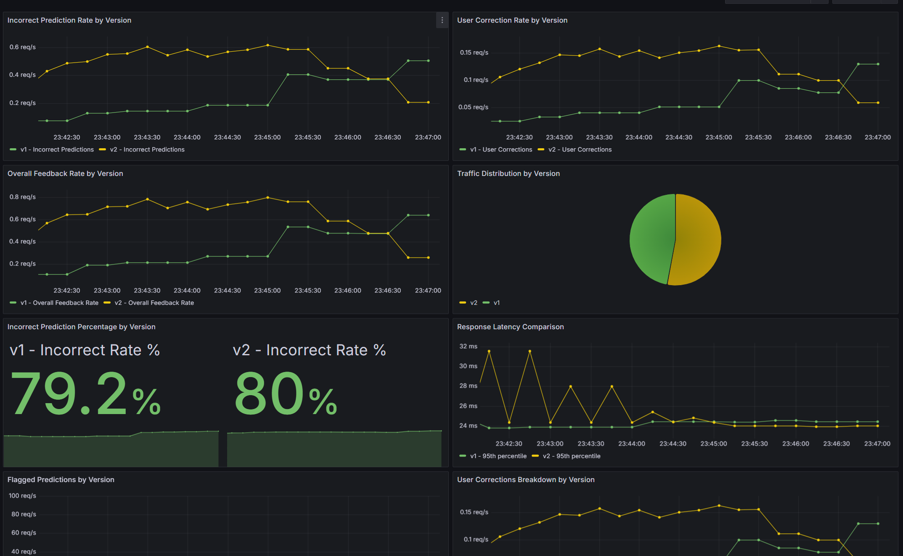

# Continuous Experimentation: Sentiment Color-Coding A/B Test


## Overview

We are conducting a canary (A/B) experiment to evaluate the impact of color-coded sentiment feedback on user engagement. The goal is to determine whether displaying sentiment results in color (green for positive, red for negative) increases user feedback compared to a neutral, non-colored display.

---

## Experiment Design

### Baseline (v0.2.2, No Color on Sentiment)

- **Frontend:** Sentiment results are shown in green (positive) or red (negative).
- **Docker image:** `ghcr.io/remla25-team2/app:v0.2.2`
- **User experience:** Immediate visual cue for sentiment.

### Experiment (v0.2.3, Color on Sentiment)

- **Frontend:** Sentiment results are shown with no color (neutral styling).
- **Docker image:** `ghcr.io/remla25-team2/app:v0.2.3`
- **User experience:** No visual color cue for sentiment.

---

## Hypothesis

> **Displaying sentiment results in color will increase the rate of user feedback compared to a non-colored display.**

- **Null hypothesis:** There is no difference in user feedback rate between color and no-color versions.
- **Alternative hypothesis:** The color version increases user feedback rate.

---

## Metrics and Monitoring

### Primary Metric

- **User Feedback Rate (Overall):**  
  The total rate of user feedback interactions per second for each version.
  - Version 1 (v0.2.2, color): `sum(rate(prediction_feedback_total{version="v1"}[5m]))`
  - Version 2 (v0.2.3, no color): `sum(rate(prediction_feedback_total{version="v2"}[5m]))`

### Secondary Metrics

- **User Correction Rate:**  
  The rate of explicit corrections provided by users per second for each version.
  - Version 1: `rate(user_corrections_total{version="v1"}[5m])`
  - Version 2: `rate(user_corrections_total{version="v2"}[5m])`

- **Incorrect Prediction Rate:**  
  The rate of predictions marked as incorrect by users per second for each version.
  - Version 1: `rate(prediction_feedback_total{user_feedback="incorrect", version="v1"}[5m])`
  - Version 2: `rate(prediction_feedback_total{user_feedback="incorrect", version="v2"}[5m])`

### Health Metrics

- **Request Rate**
- **Latency**
- **Error Rate**

### Monitoring

- **Grafana Dashboard:**  
  The `A/B Testing Dashboard` visualizes feedback rates, correction rates, traffic split, and health metrics for both versions.
- **Prometheus:**  
  Scrapes metrics from both app versions, labeled by `version`.

---

## Traffic Management

- **Istio VirtualService:**  
  Splits traffic 70% to v0.2.2 (color) and 30% to v0.2.3 (no color) using sticky sessions (consistent hash on cookie).
- **Helm values.yaml:**
    ```yaml
    experiment:
      enabled: true
      versions:
        v1:
          weight: 90
          image:
            repository: ghcr.io/remla25-team2/app
            tag: v0.2.2
        v2:
          weight: 10
          image:
            repository: ghcr.io/remla25-team2/app
            tag: v0.2.3
    ```

## Success Criteria

- **Primary Success Criterion:**  
  Version 2 (no color, v0.2.3) should demonstrate a **≥10% relative improvement** in overall feedback rate compared to Version 1 (color, v0.2.2). This means:
  ```
  (feedback_rate_v2 - feedback_rate_v1) / feedback_rate_v1 ≥ 0.10
  ```

- **Secondary Success Criteria:**
  - No statistically significant increase in incorrect prediction rate for v2 compared to v1
  - User correction rate should remain stable or improve for v2
  - Health metrics (request rate, latency, error rate) must not degrade by more than 5%

- **Statistical Significance:**  
  Results must be statistically significant with p-value < 0.05 over a minimum observation period of 5 minutes.

- **Failure Conditions:**  
  - v2 shows <10% improvement or worse performance in feedback rate
  - Significant increase in incorrect predictions for v2
  - Health metrics degrade by >5%
  - Insufficient statistical significance after observation period

- **Failure:**  
  If there is no significant difference, or the no-color version performs better, or health metrics degrade, the experiment is considered unsuccessful.

---

## Results

### Primary Metric: User Feedback Rate
- **Observation:** The no-color version (v2) did not achieve the required **≥10% relative improvement** in overall feedback rate compared to the color version (v1). The feedback rates remained close, with v2 failing to outperform v1 significantly.

### Secondary Metrics
- **Incorrect Prediction Rate:**  
  The incorrect prediction rate for v2 was higher than v1, with v2 reaching **80%** compared to v1's **79.2%**. This indicates a slight increase in incorrect predictions for the no-color version.
- **User Correction Rate:**  
  User correction rates remained stable across both versions, with no significant difference observed.

### Health Metrics
- **Latency:**  
  Response latency comparison showed consistent performance across both versions, with no degradation observed.
- **Traffic Distribution:**  
  Traffic split adhered to the configured weights, with v1 receiving 70% and v2 receiving 30%.

### Conclusion
- **Outcome:** The experiment did not meet the primary success criterion. Additionally, the higher incorrect prediction rate for v2 raises concerns about its performance.
- **Recommendation:** Based on the results, the no-color version (v2) does not demonstrate sufficient improvement to justify adoption. Further investigation into the impact of color-coded sentiment feedback is recommended before proceeding with changes.

